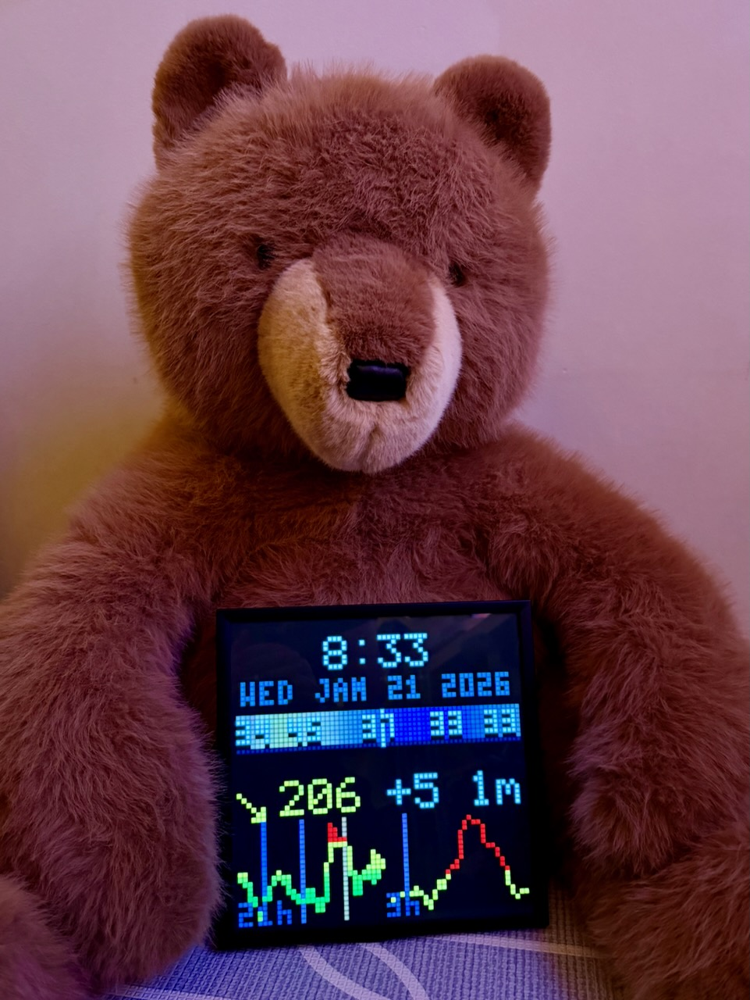
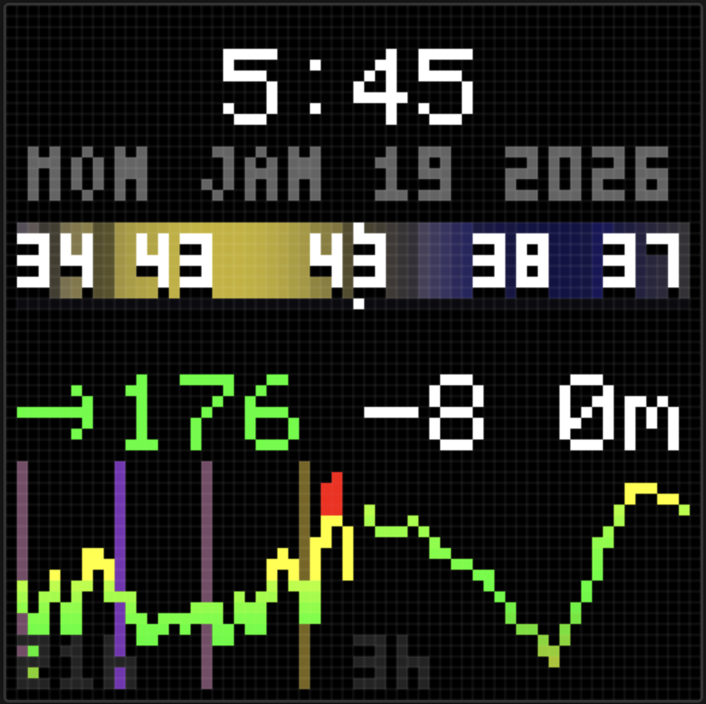

# Signage

[](https://opensource.org/licenses/MIT)
[](https://github.com/jwulff/signage/actions/workflows/ci.yml)

Personal digital signage system for Pixoo64 and other LED matrix displays. Displays real-time data like blood sugar (Dexcom CGM), time, weather, and sleep readiness (Oura Ring).

<p align="center">
  
  
</p>

**Read the full story:** [Building a Personal Digital Signage System](https://johnwulff.com/2026/01/18/pixoo-signage/)

```
┌─────────────┐     ┌─────────────┐     ┌──────────────┐     ┌─────────────┐
│   Lambda    │────▶│  WebSocket  │────▶│    Relay     │────▶│   Pixoo64   │
│  (content)  │     │     API     │     │    (CLI)     │     │  (display)  │
└─────────────┘     └──────┬──────┘     └──────────────┘     └─────────────┘
                          │
                          │             ┌──────────────┐
                          └────────────▶│ Web Emulator │
                                        │  (browser)   │
                                        └──────────────┘
```

## Table of Contents

- [Features](#features)
- [Quick Start (Local Development)](#quick-start-local-development)
- [Fork & Deploy Your Own](#fork--deploy-your-own)
  - [Prerequisites](#prerequisites)
  - [Step 1: Fork & Clone](#step-1-fork--clone)
  - [Step 2: AWS Account Setup](#step-2-aws-account-setup)
  - [Step 3: Domain Configuration](#step-3-domain-configuration)
  - [Step 4: GitHub Secrets](#step-4-github-secrets)
  - [Step 5: Deploy](#step-5-deploy)
  - [Step 6: Configure Data Sources](#step-6-configure-data-sources)
  - [Step 7: Connect Your Display](#step-7-connect-your-display)
- [Architecture](#architecture)
- [Packages](#packages)
- [API Reference](#api-reference)
- [Relay CLI](#relay-cli)
- [Cloud Relay (Optional)](#cloud-relay-optional)
- [Cost Estimate](#cost-estimate)
- [Troubleshooting](#troubleshooting)
- [License](#license)

## Features

- **Real-time updates** - Content pushes to displays every minute via WebSocket
- **Multiple displays** - Connect Pixoo64 devices, web browsers, or custom terminals
- **Blood sugar tracking** - Integrates with Dexcom CGM (requires Dexcom Share account)
- **Sleep readiness** - Integrates with Oura Ring (optional)
- **Web emulator** - View your display in any browser
- **Serverless** - Runs on AWS Lambda, scales to zero when idle
- **Low cost** - ~$5-15/month for typical usage

## Quick Start (Local Development)

Run locally without deploying to AWS:

```bash
# Clone the repo
git clone https://github.com/YOUR_USERNAME/signage.git
cd signage

# Install dependencies (requires Node.js 20+ and pnpm 9+)
pnpm install

# Start local development server
pnpm dev:local
```

This starts:
- **Web emulator** at http://localhost:5173
- **WebSocket server** at ws://localhost:8080

On first run, you'll be prompted for Dexcom credentials (optional - skip to use mock data).

---

## Fork & Deploy Your Own

### Prerequisites

Before starting, ensure you have:

| Requirement | Version | Check Command |
|-------------|---------|---------------|
| Node.js | 20+ | `node --version` |
| pnpm | 9+ | `pnpm --version` |
| AWS CLI | 2+ | `aws --version` |
| GitHub account | - | - |
| AWS account | - | - |
| Domain name | - | For custom URLs (optional but recommended) |

### Step 1: Fork & Clone

1. **Fork this repository** on GitHub
2. **Clone your fork**:
   ```bash
   git clone https://github.com/YOUR_USERNAME/signage.git
   cd signage
   ```
3. **Install dependencies**:
   ```bash
   pnpm install
   ```
4. **Verify tests pass**:
   ```bash
   pnpm test
   pnpm lint
   ```

### Step 2: AWS Account Setup

#### Create an IAM User for Deployments

1. Go to [AWS IAM Console](https://console.aws.amazon.com/iam/)
2. Create a new user (e.g., `signage-deploy`)
3. Attach the `AdministratorAccess` policy (or create a custom policy - see below)
4. Create an **Access Key** and save the credentials

<details>
<summary>Minimum IAM Policy (instead of AdministratorAccess)</summary>

```json
{
  "Version": "2012-10-17",
  "Statement": [
    {
      "Effect": "Allow",
      "Action": [
        "cloudformation:*",
        "lambda:*",
        "apigateway:*",
        "dynamodb:*",
        "s3:*",
        "cloudfront:*",
        "iam:*",
        "events:*",
        "secretsmanager:*",
        "route53:*",
        "acm:*",
        "logs:*",
        "bedrock:InvokeModel"
      ],
      "Resource": "*"
    }
  ]
}
```

</details>

#### Configure AWS CLI

```bash
aws configure
# Enter your Access Key ID, Secret Access Key
# Default region: us-east-1 (required - SST deploys here)
# Default output: json
```

Verify:
```bash
aws sts get-caller-identity
```

### Step 3: Domain Configuration

SST can create custom domains for your APIs. Domain configuration is controlled via the `SIGNAGE_DOMAIN` environment variable.

#### Option A: Use Your Own Domain (Recommended)

1. **Register a domain** (if you don't have one) via Route 53 or any registrar
2. **Create a Route 53 Hosted Zone** for your domain:
   ```bash
   aws route53 create-hosted-zone --name yourdomain.com --caller-reference $(date +%s)
   ```
3. **Update your domain's nameservers** to point to Route 53 (if using external registrar)
4. **Set the domain when deploying**:

   ```bash
   # For manual deployments
   SIGNAGE_DOMAIN=yourdomain.com pnpm deploy

   # For GitHub Actions, add SIGNAGE_DOMAIN as a repository secret (see Step 4)
   ```

   This will create these subdomains:
   - `signage.yourdomain.com` - Web emulator
   - `api.signage.yourdomain.com` - HTTP API
   - `ws.signage.yourdomain.com` - WebSocket API

   For non-prod stages, the stage name is prefixed (e.g., `dev.signage.yourdomain.com`).

#### Option B: Use AWS Default Domains

If you don't set `SIGNAGE_DOMAIN`, SST will use default AWS URLs:
- `https://abc123.execute-api.us-east-1.amazonaws.com`
- `https://d1234567890.cloudfront.net`

This is useful for testing or if you don't have a custom domain.

### Step 4: GitHub Secrets

For automated CI/CD deployments, add these secrets to your GitHub repository:

1. Go to your repo → **Settings** → **Secrets and variables** → **Actions**
2. Add these secrets:

| Secret Name | Value | Required |
|-------------|-------|----------|
| `AWS_ACCESS_KEY_ID` | Your IAM user's access key ID | Yes |
| `AWS_SECRET_ACCESS_KEY` | Your IAM user's secret access key | Yes |
| `SIGNAGE_DOMAIN` | Your domain (e.g., `yourdomain.com`) | No |

**Note:** If `SIGNAGE_DOMAIN` is not set, SST will use default AWS URLs instead of custom domains.

### Step 5: Deploy

#### First Deployment (Manual)

Deploy to the `dev` stage first:

```bash
pnpm deploy
```

This takes 3-5 minutes and outputs your deployed URLs:

```
✔ Complete
   SignageApi: wss://abc123.execute-api.us-east-1.amazonaws.com
   SignageTestApi: https://xyz789.execute-api.us-east-1.amazonaws.com
   SignageWeb: https://d1234567890.cloudfront.net
```

#### Production Deployment

```bash
pnpm deploy:prod
```

#### Automated Deployments

After the first manual deployment, pushing to `main` automatically deploys to `dev`.

To deploy to production, use the GitHub Actions workflow:
1. Go to **Actions** → **Deploy**
2. Click **Run workflow**
3. Select `prod` stage

### Step 6: Configure Data Sources

#### Dexcom (Blood Sugar Widget)

If you use a Dexcom CGM:

1. **Create a follower account** at [dexcom.com/share](https://www.dexcom.com/share)
2. **Set SST secrets**:
   ```bash
   # For dev stage
   pnpm sst secret set DexcomUsername your_username
   pnpm sst secret set DexcomPassword your_password

   # For prod stage
   pnpm sst secret set DexcomUsername your_username --stage prod
   pnpm sst secret set DexcomPassword your_password --stage prod
   ```

#### Oura Ring (Readiness Widget) - Optional

Displays your daily Oura readiness score with color-coded status:
- **Green** (85-100): Optimal
- **Yellow-green** (70-84): Good
- **Yellow** (60-69): Fair
- **Orange** (50-59): Low
- **Red** (<50): Poor

Supports multiple users - each shows as initial + score (e.g., "J 82  S 75").

**Setup:**

1. **Create an OAuth app** at [cloud.ouraring.com](https://cloud.ouraring.com/oauth/applications)
2. **Set redirect URIs** in your Oura app:
   - Development: `https://api.dev.signage.yourdomain.com/oura/auth/callback`
   - Production: `https://api.signage.yourdomain.com/oura/auth/callback`
3. **Set SST secrets**:
   ```bash
   pnpm sst secret set OuraClientId your_client_id
   pnpm sst secret set OuraClientSecret your_client_secret

   # For prod stage
   pnpm sst secret set OuraClientId your_client_id --stage prod
   pnpm sst secret set OuraClientSecret your_client_secret --stage prod
   ```
4. **Authorize each user** by visiting (the `name` parameter is required):
   ```
   https://api.signage.yourdomain.com/oura/auth/start?name=John
   ```
   The first letter of the name becomes the initial shown on the display.

**How it works:**
- Readiness scores are fetched daily at 7 AM Pacific
- Scores are cached and displayed until the next fetch
- If no data is available, shows "--" in gray

### Step 7: Connect Your Display

#### Option A: Web Emulator

Open your web URL in a browser:
```
https://signage.yourdomain.com
```

#### Option B: Pixoo64 (Local Relay)

Run the relay on any computer on the same network as your Pixoo:

```bash
cd packages/relay
pnpm build
node dist/cli.js --ws wss://ws.signage.yourdomain.com
```

First run will scan for Pixoo devices and save the IP.

#### Option C: Pixoo64 (Cloud Relay)

Run the relay on a cloud server for 24/7 operation without a local computer. See [Cloud Relay](#cloud-relay-optional) below.

---

## Architecture

### AWS Services Used

| Service | Purpose |
|---------|---------|
| **API Gateway WebSocket** | Real-time connections to displays |
| **API Gateway HTTP** | REST endpoints for testing |
| **Lambda** | Content generation and WebSocket handlers |
| **DynamoDB** | Connection state and cached data |
| **CloudFront + S3** | Web emulator hosting |
| **EventBridge** | Scheduled content updates (every minute) |
| **Secrets Manager** | API credentials storage |
| **Bedrock** | AI news digest (optional) |

### Data Flow

1. **EventBridge** triggers the compositor Lambda every minute
2. **Lambda** fetches data (Dexcom, weather, Oura) and renders a 64×64 frame
3. **Frame** is broadcast via WebSocket to all connected terminals
4. **Terminals** (relay, web emulator) display the frame

## Packages

| Package | Description |
|---------|-------------|
| `@signage/core` | Shared types and Pixoo protocol (RGB encoding) |
| `@signage/functions` | Lambda handlers for WebSocket and HTTP APIs |
| `@signage/relay` | CLI that bridges WebSocket to local Pixoo HTTP API |
| `@signage/web` | React web emulator with canvas-based display |
| `@signage/local-dev` | Local development server (no AWS needed) |

## API Reference

### Test Bitmap Endpoint

Generate and broadcast test patterns:

```bash
# Rainbow gradient
curl "https://api.signage.yourdomain.com/test-bitmap?pattern=rainbow"

# Color bars
curl "https://api.signage.yourdomain.com/test-bitmap?pattern=bars"

# Custom text
curl "https://api.signage.yourdomain.com/test-bitmap?pattern=text&text=Hello&color=pink"
```

| Parameter | Values | Default |
|-----------|--------|---------|
| `pattern` | `rainbow`, `bars`, `text` | `rainbow` |
| `text` | any string | `Hello` |
| `color` | `white`, `red`, `green`, `blue`, `yellow`, `cyan`, `magenta`, `orange`, `pink` | `white` |

### Health Check

```bash
curl "https://api.signage.yourdomain.com/health"
```

## Relay CLI

The relay connects a local Pixoo64 to the cloud WebSocket API.

### Installation

```bash
cd packages/relay
pnpm install
pnpm build
```

### Usage

```bash
# Auto-discover Pixoo (saved for future runs)
node dist/cli.js --ws wss://ws.signage.yourdomain.com

# Specify IP manually
node dist/cli.js --pixoo 192.168.1.100 --ws wss://ws.signage.yourdomain.com

# Scan network for devices
node dist/cli.js scan

# Forget saved IP
node dist/cli.js forget
```

### Options

| Option | Required | Description |
|--------|----------|-------------|
| `--ws <url>` | Yes | WebSocket API URL |
| `--pixoo <ip>` | No | Pixoo IP (auto-discovered if not provided) |
| `--terminal <id>` | No | Custom terminal ID |

## Cloud Relay (Optional)

Run the relay on AWS Lightsail for 24/7 operation without keeping a local computer on.

**Cost**: ~$3.50/month

**Requirements**:
- Router with WireGuard support (UniFi, pfSense, OpenWrt, etc.)
- Static IP or Dynamic DNS for your home

See the complete guide: [deploy/lightsail/README.md](deploy/lightsail/README.md)

## Cost Estimate

| Component | Monthly Cost |
|-----------|-------------|
| Lambda | ~$1-3 (free tier covers most) |
| DynamoDB | ~$1-5 (on-demand) |
| API Gateway | ~$1-5 (free tier: 1M requests) |
| CloudFront/S3 | ~$0.50-2 |
| Secrets Manager | ~$0.40 |
| **Total AWS** | **~$5-15** |
| Lightsail relay (optional) | +$3.50 |

## Troubleshooting

| Issue | Solution |
|-------|----------|
| `pnpm: command not found` | Install pnpm: `npm install -g pnpm` |
| `Cannot find module 'sst'` | Run `pnpm install` in project root |
| Deployment fails with credentials error | Check `aws sts get-caller-identity` works |
| WebSocket connection fails | Verify domain configuration in `infra/api.ts` |
| Dexcom widget shows no data | Run `pnpm sst secret list` to verify secrets are set |
| Relay can't find Pixoo | Ensure Pixoo is on same network, try `node dist/cli.js scan` |
| CloudFront shows old content | Wait 5 minutes or invalidate cache in AWS console |

### Logs

View Lambda logs:
```bash
pnpm sst dev  # Shows logs in real-time during development
```

Or in AWS Console:
1. Go to CloudWatch → Log groups
2. Find `/aws/lambda/...` groups for your functions

## Development

### Local Development (No AWS)

```bash
pnpm dev:local
```

### With AWS (Hot Reload)

```bash
pnpm dev
```

### Run Tests

```bash
pnpm test        # Run once
pnpm test:watch  # Watch mode
```

### Build

```bash
pnpm build
```

## License

MIT License - see [LICENSE](LICENSE) for details.

---

## Contributing

1. Fork the repository
2. Create a feature branch
3. Make your changes
4. Run tests: `pnpm test && pnpm lint`
5. Submit a pull request

See [CONTRIBUTING.md](CONTRIBUTING.md) for detailed guidelines.
